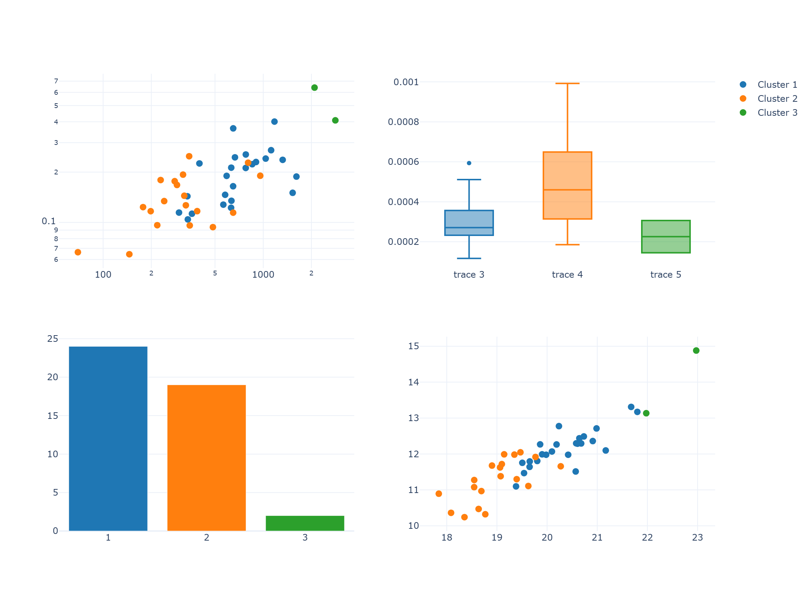
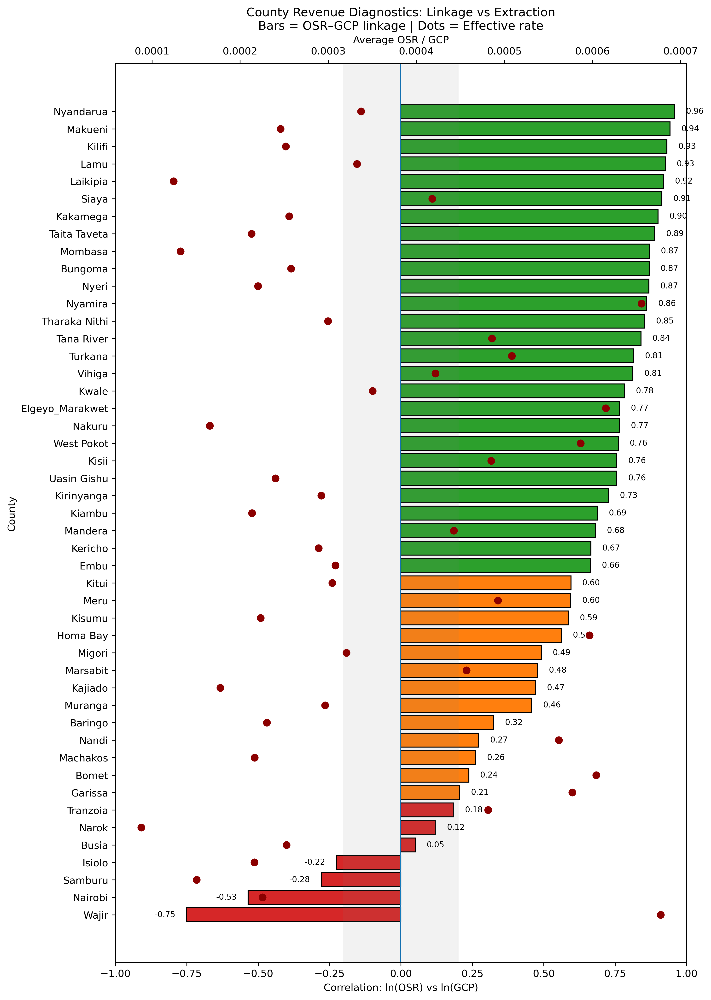
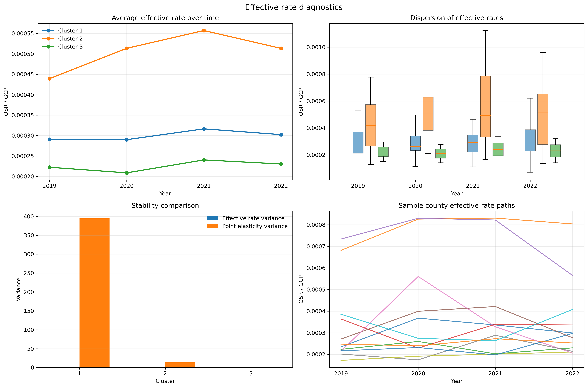
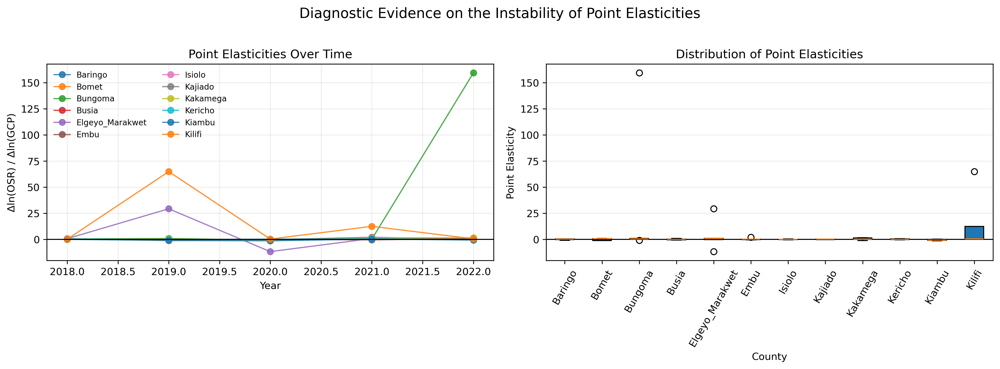

# County Revenue Forecasting System  
### A Machine Learning Approach to Subnational Fiscal Planning  

A county-level forecasting system that adapts to structural differences in revenue performance, moving beyond traditional elasticity-based models.

---

## Motivation

County revenue forecasting is typically anchored on a simple assumption: that economic activity (GCP) translates predictably into Own-Source Revenue (OSR).

In practice, this assumption does not hold.

Across counties, revenue performance is shaped by:
- administrative capacity  
- compliance and enforcement systems  
- sectoral structure  
- institutional effectiveness  

—not just economic growth.

This project develops a **data-driven forecasting framework** that reflects these realities.

---

## Approach

The model combines three layers of analysis:

- **Machine learning (clustering)** to group counties by structural similarity  
- **Econometric modelling** to estimate alternative revenue relationships  
- **Model selection** to assign the best-performing specification per county  

Three competing models are evaluated:

- **Trend-only model** — captures administrative and structural momentum  
- **Trend + elasticity model** — links revenue to economic activity  
- **Trend + growth-adjusted model** — captures short-run co-movement without imposing unstable long-run relationships  

Models are selected based on:
- forecast accuracy (MAPE)  
- economic plausibility  
- parameter stability  

---

## Key Findings

### 1. Counties are structurally different



Counties cluster into three distinct groups:

- **Cluster 1**: Moderate capacity, relatively stable systems  
- **Cluster 2**: High extraction, high dispersion  
- **Cluster 3**: Low but stable systems  

**Implication:**  
A single forecasting model cannot be applied uniformly.

---

### 2. Economic growth does not consistently drive revenue


- OSR and GCP often move independently  
- Timing and direction frequently diverge  

**Implication:**  
Growth alone is not a reliable predictor of revenue performance.

---

### 3. Revenue is often decoupled from economic activity



- Some counties extract high revenue with weak economic linkage  
- Others show strong growth with limited revenue response  

**Interpretation:**  
Revenue outcomes are frequently **policy- and administration-driven**, rather than purely economic.

---

### 4. Effective rates are uneven and unstable



- Significant variation across counties  
- High-performing counties tend to be more volatile  

**Implication:**  
Revenue gains may be driven by unstable or unsustainable mechanisms.

---

### 5. Elasticities are unstable



- Elasticities vary widely across time and counties  
- Negative and inconsistent estimates are common  

**Implication:**  
Traditional elasticity-based forecasting is unreliable in this context.

---

## Model Outcome

Instead of imposing a uniform structure, the system adapts to each county.

| Model Type | Typical Use |
|------------|-------------|
| Trend-only | Dominant (structural/admin driven) |
| Elasticity-based | Limited cases |
| Growth-adjusted | Select, dynamic cases |

---

## Policy Implications

- **Revenue is not automatic** — it must be actively managed  
- **Administrative systems matter as much as economic base**  
- **Uniform revenue targets are misleading**  
- **Flexible, data-driven forecasting frameworks are essential**  

---

## Deployment

The system is fully operational and deployable.

**Core components:**
- `model_selection.py` → selects best model per county  
- `model.py` → generates forecasts  
- `app.py` → interactive dashboard  

**Run locally:**

```bash
python model_selection.py
streamlit run app.py